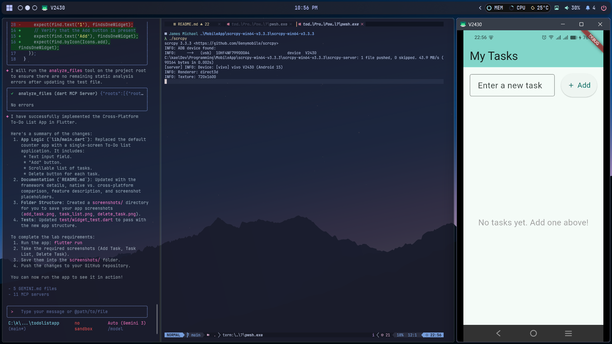
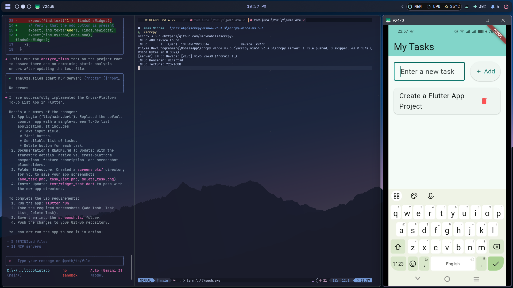
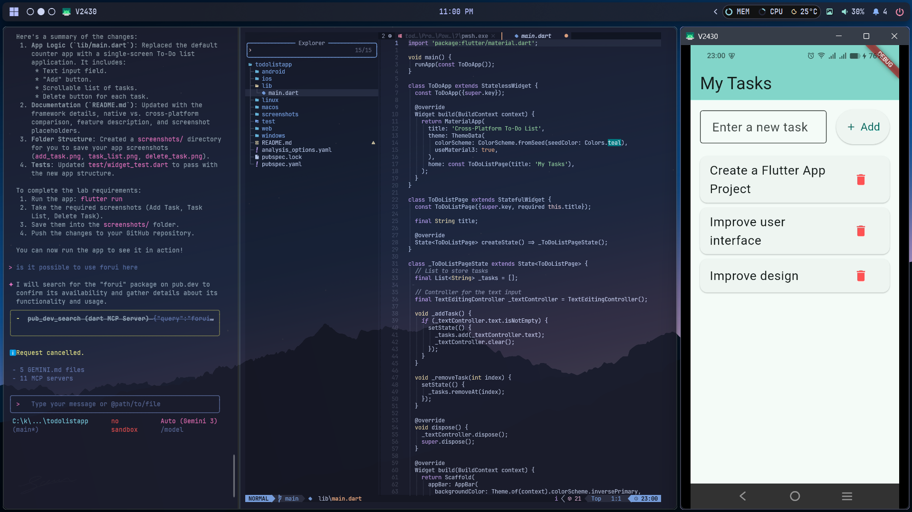
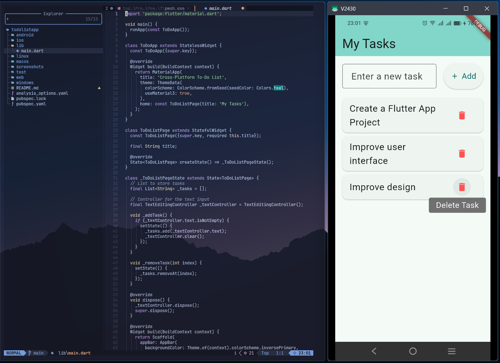
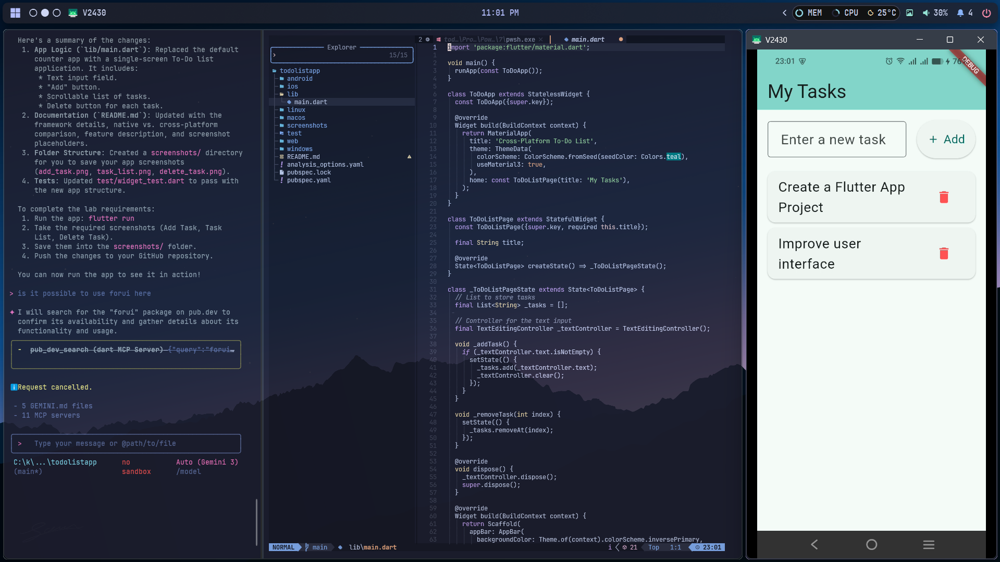

# Cross-Platform To-Do List App

## Framework Used
**Flutter**

## Native vs Cross-Platform Development

**Native Development** involves building applications specifically for a single platform (like iOS or Android) using platform-specific languages (Swift/Objective-C for iOS, Kotlin/Java for Android).
*   **Pros:** Best performance, full access to device APIs, native look and feel.
*   **Cons:** Higher cost and time (separate codebases), requires different skill sets.

**Cross-Platform Development** (like Flutter) allows developers to write code once and deploy it to multiple platforms.
*   **Pros:** Faster development (single codebase), lower cost, consistent UI across platforms.
*   **Cons:** Performance might be slightly lower than native for complex tasks, potentially delayed access to new OS features.

## App Features
This application is a simple, single-screen To-Do list manager designed to demonstrate basic state management and UI construction in Flutter.

*   **Add Tasks:** Users can type a task description and add it to the list using the "Add" button or keyboard submission.
*   **View Tasks:** A scrollable list displays all active tasks.
*   **Remove Tasks:** Each task has a delete button (trash icon) to remove it from the list.
*   **Empty State:** Displays a friendly message when the list is empty.

## Screenshots

| Main UI | Add Task | Task List |
|:---:|:---:|:---:|
|  |  |  |

| Delete Task | Task Deleted |
|:---:|:---:|
|  |  |

*Note: Screenshots are located in the `screenshots/` directory.*